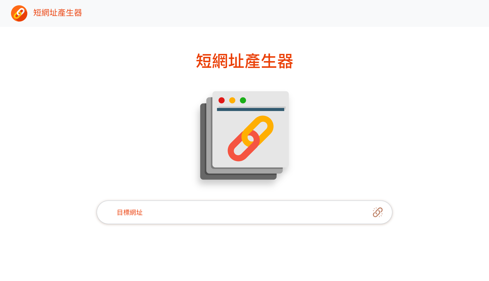
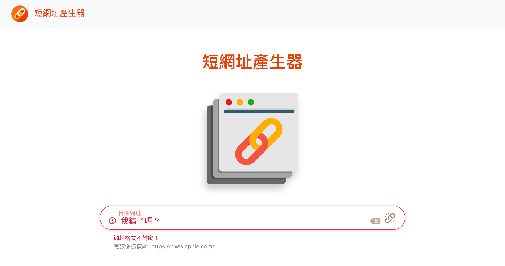
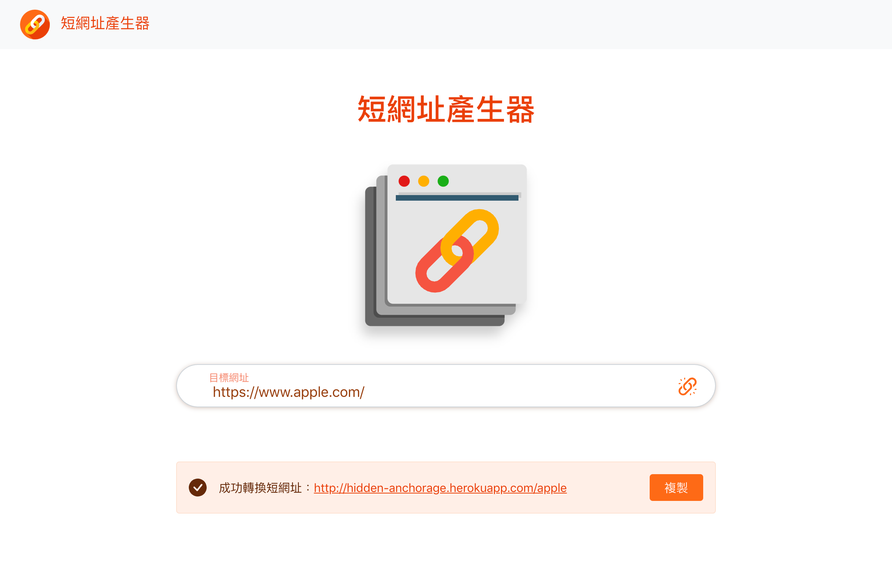
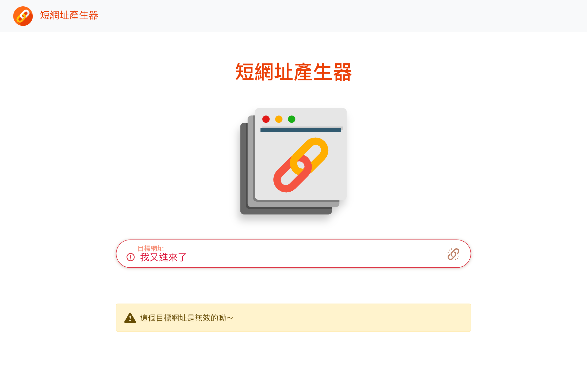
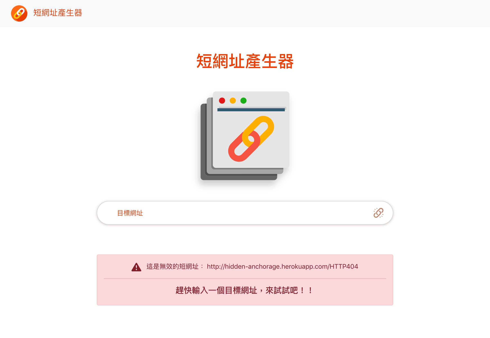

# 短網址產生器
[](https://standardjs.com/)

將使用者輸入的目標網址，轉換為固定長度的短網址


- 短網址功能
  - [X] 縮短目標網址
  - 目標網址轉換為隨機５位數英文、數字組合網址
  <br>目標網址輸入 https://www.apple.com/ 轉換為 https://『hostname』/apple
  - [X] 短網址轉址
  - 在伺服器啟動期間，可將產生的短網址轉址至目標網址
  <br>在網址列輸入 https://『hostname』/apple 會到達 https://www.apple.com/

- 目標網址例外處理機制
  - [X] 瀏覽器表單驗證
  - [X] 前端驗證，即時提示使用者
  - [X] 後段套件驗證，傳回頁面提示使用者

- 提升使用者體驗設計
  - [X] 輸入網址格式正確時，即時點亮按鈕
  - [X] 焦點離開輸入框時，才顯示輸入網址錯誤提示
  - [X] 輸入框提供清空文字按鈕
  - [X] 短網址複製按鈕
  - [X] 無效短網址提示

<br>

<center>





</center>
<br><br>

## 1.安裝專案資料
1. 將原始碼安裝至指定位置，你可以採取下列其中一種方法
    1. 點選右上方綠色『Code』按鈕，選擇『Download ZIP』下載ZIP檔，並解壓縮至專案資料夾中。
    2. 開啟『終端機 Terminal.app』，或在Ｗindows 開啟『命令提示字元 cmd』
 
    輸入指令，移動到該專案資料夾位置
    ```
    cd 「專案資料夾路徑」 (資料夾名稱間的空格要用「 / 」隔開)
    ```
    輸入指令將專案clone至專案資料夾
    ```
    git clone https://github.com/Pudding1989/URL-Shortener.git
    ```

2. 安裝伺服器至指定位置
   1. 下載 [MongoDB Community Server](https://www.mongodb.com/try/download/community) （專案使用 for MacOS的 4.2.15 版本），並解壓縮至指定位置，重新命名為「mongodb」
   2. 建立資料庫資料夾，命名為「mongodb-data」
   3. 「mongodb」(資料庫伺服器資料夾)及「mongodb-data」(資料庫資料夾)，可以與專案原始碼資料夾不同位置
 
<br>

## 2.啟動資料庫
### 開啟『終端機 Terminal.app』，或在Ｗindows開啟『命令提示字元 cmd』執行以下指令
<br>

1. 移動至伺服器資料夾「mongodb」的下一層執行檔資料夾「bin」

    ```
    cd 「mongodb(MongoDB Community Server) 資料夾路徑」\bin
    ```

2. 執行下列指令，啟動資料庫伺服器

- 瀏覽網站時，要保持資料庫伺服器運作，否則網站將無法讀取資料

   ```
   ./mongod --dbpath 「mongodb-data」(資料庫資料夾)完整路徑
   ```  
<br>

## 3.啟動專案
### 另外開啟一個終端機視窗(或是命令提示字元)，並保持資料庫伺服器持續執行中
<br>

1. 移動到專案資料夾  

```
cd 「專案資料夾路徑」 (資料夾名稱間的空格要用「 \ 」隔開)
```
2. 建立種子資料
```
npm run seed
```
   - 指令執行完畢後，終端機會恢復可輸入狀態。
    <br>如果程式沒有自動結束，終端機顯示 `「播種完畢 <(￣︶￣)>」`訊息後，即可按下 ` ⌃ (Ctrl) + c` 退出程式
3. 安裝本專案使用的套件
```
npm install
```
4. 輸入執行指令，開啟本地端應用程式伺服器及資料庫伺服器
```
npm run dev
```
- 當終端機顯示訊息 `NOW, Express is start listening on http://localhost:3000` ，表示已成功開啟應用程式伺服器
- 當終端機顯示訊息 `MongoDB Connected  ｡:.ﾟヽ(*´∀)ﾉﾟ.:｡ `，表示已成功連線至資料庫伺服器

5. 於瀏覽器開啟網站
```
http://localhost:3000/
```

6. 記得在終端機按下 ` ⌃ (Ctrl) + c` 或是在命令提示字元 `ctrl + c` ，關閉本應用程式伺服器及資料庫伺服器

## 開發工具版本

後端框架
- Node.js: 14.16.0

後端套件
- Node Express: 4.17.1
- valid-url: 1.0.9

資料庫
- Mongoose: 6.0.5

模板引擎
- Express Handlebars: 5.3.3

前端框架
- Bootstrap: 5.1.1

  Bootstrap JavaScript plugin
    - Popper: 2.9.3 min UMD build

Coding Style 檢查套件
- JavaScript Standard Style: 16.0.3